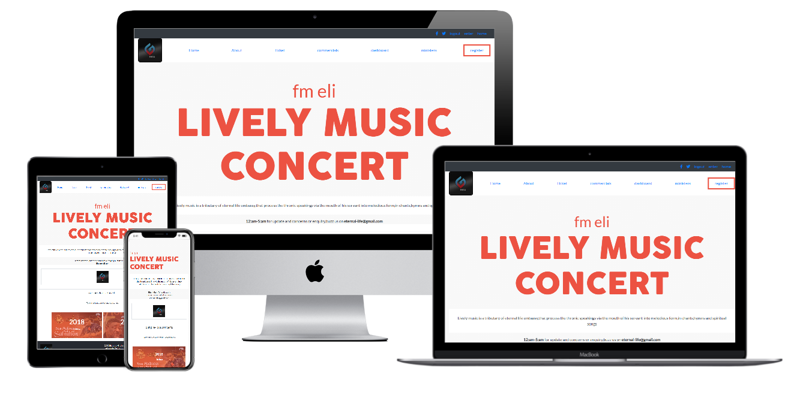

# conference-capstone-project

> This is a capstone project on a music concert which was coined out from the given design outline of a conference page.

I took a painstaking process to archieve the given requirement of this project.

  -creat a repository
  -clone it to my work station
  -add all the needed files, and folders and checked out of the main branch to a feature branch
  -add my bootstrap links and other external links for icon features
  -use semantic html
  -build my website with bootstrap and used media queries and css stylings
  -make regular commits and pushes to github

## Built With

- HTML
- bootstrap
- CSS
- Font Awesome
- google-fonts

## Live Demo

[Live Demo Link](https://raw.githack.com/wintan1418/conference-capstone-project/feature-branch/home.html).

(video-presentation):https://www.loom.com/share/13ae42683b5749a6802a15d90904bd14
## Author

👤 **Oluwadare Juwon**

- GitHub: [@wintan1418](https://github.com/wintan1418)
- Twitter: [@juwonoluwadare](https://twitter.com/oluwadarejuwon)
- LinkedIn: [Oluwadare Juwon](https://www.linkedin.com/in/oluwadare-juwon-048a391a8/)

ACKNOWLEDGEMENT
-i acknowledge the odin project materials.
-thanks to former partners,silas kalu and stand up team member david.
-thanks to the entire microverse team.
-

## �� Contributing
You can freely contribute to this project by:
 cloning this repo directly to your work station and raising issues,both positive and notify me if you feel it could be more improved,thank you!.
## Show your support
Give a ⭐️ if you like this project!

